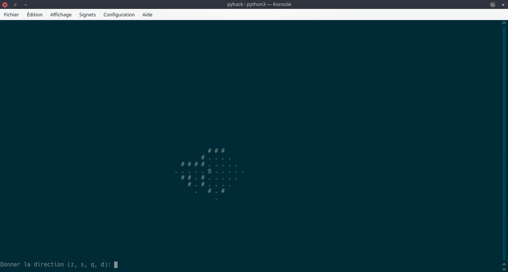

<h1 align="center">pyhack</h1>
<h4 align="center">Jeu pyhack développé en Python dans le terminal.</h4>


## Status


Pour plus d'information sur le projet consulter ```pyhack.pdf```.

### Choix de modélisation
On choisit de stocker l'état d'une case dans un array numpy 2D.

On utilise une classe ```Room``` pour représenter les salles.
 - Placement des salles.
 - Création d'un (ou plusieurs) labyrinthe(s) entre les salles.
 - Raccordement du (des) labyrinthe(s).
 - Suppression des portions de couloir sans issues.

## Pour commencer
Ce programme requiert une version de python supérieure ou égale à 3.6.
Il faut s'assurer d'avoir les différents modules installés ainsi que leur dépendances.
```sh
# Cloner le répertoire
git clone https://github.com/NicovincX2/pyhack
cd pyhack/
# Installation des dépendances
python3 -m pip install -r requirements.txt
# Lancement du jeu
python3 launch.py -h
```

# Installation pour le développement
Ci-dessous la procédure d'installation d'un environnement de développement avec ```pipenv ```.
```sh
# Install dependencies
pipenv install --dev

# Setup pre-commit and pre-push hooks (optional)
pipenv run pre-commit install -t pre-commit
pipenv run pre-commit install -t pre-push
```
Les packages suivants sont directements disponibles :
```sh
black, isort, flake8, pytest (-s -v), pytest --cov --cov-fail-under=100
```

Voici maintenant quelques indications :
 - pour exécuter un package ```pipenv run <package>```.
 *Tous les packages sont exécutés avant chaque commit et chaque push si les hooks correspondants sont activés.*
 - pour passer outre les hooks pre-commit et pre-push ```git commit/push --no-verify```.

### Profiling
Il est utile d'évaluer le temps d'exécution de chaque fonction lors de la génération de la carte pour optimiser le programme.
```sh
bash performances.sh perf.prof pyhack.py
```

### Fichiers
 - ```pyhack.py```: Code de base à exécuter.
 - ```utils.py```: Fonctions utilitaires.
 - ```launch.py```: Lancement du jeu.
 - ```log.py```: Création du logger.
 - ```game.log```: Fichier log de la génération de la carte et du déroulement de la partie.

### TODO
- [x] Mettre en place un logging de la partie.
- [x] Faire les tests dans ```test/```.
- [ ] Implémenter ```get_terminal_size()``` sur Windows.
- [ ] Sauvegarde d'une partie en cours.
- [ ] Création de différents niveaux de difficulté.

## Download

## Credits
Ce programme utilise les modules Python suivants (sans mentionner leurs dépendances respectives):

 - ```numpy```
